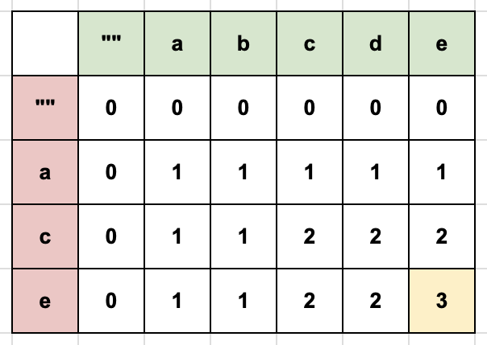
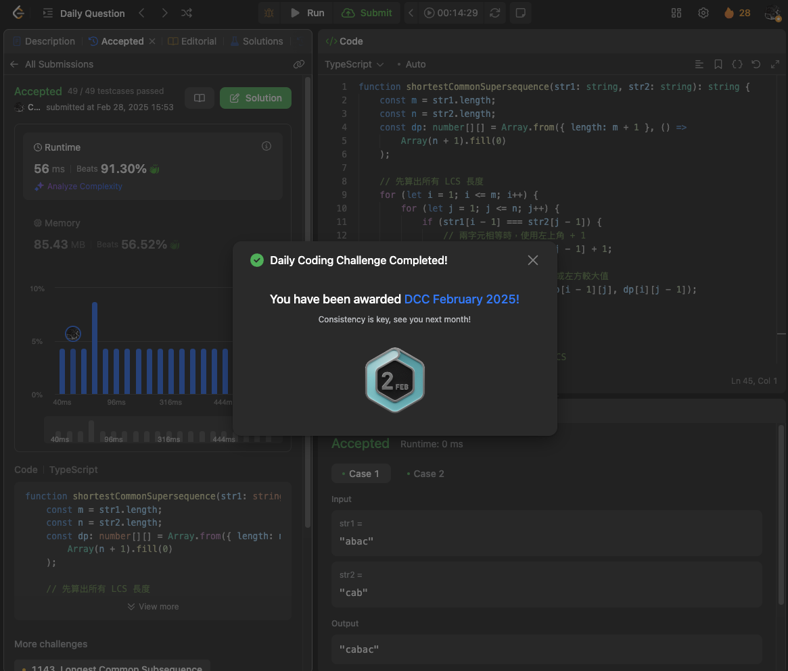

# [H] 1092. Shortest Common Supersequence (SCS)

## 題目

- [LeetCode 連結](https://leetcode.com/problems/shortest-common-supersequence)
- **主題**：String、Dynamic Programming
- **難度**：Hard (Rating: 1976)
- **Daily**：2025-02-28，二月的最後一天竟然是題 Hard

## 題目描述

給定兩個字串 `str1` 和 `str2`，請返回一個最短的字串，使得 `str1` 和 `str2` 都是它的子序列。如果存在多個可行解，返回任意一個即可。

備註：子序列定義：一個字串 `s` 是另一個字串 `t` 的子序列，表示可以通過刪除 `t` 中的某些（可以是零個）字符得到 `s`。

### 範例 1

```plain
輸入：str1 = "abac", str2 = "cab"
輸出："cabac"
解釋：
"abac" 是 "cabac" 的子序列，因為我們可以刪除第一個 "c"。
"cab" 是 "cabac" 的子序列，因為我們可以刪除最後的 "ac"。
提供的答案是滿足上述屬性的最短字串。
```

### 範例 2

```plain
輸入：str1 = "aaaaaaaa", str2 = "aaaaaaaa"
輸出："aaaaaaaa"
```

### 限制條件

- `1 <= str1.length, str2.length <= 1000`
- `str1` 和 `str2` 由小寫英文字母組成。

---

## 提出思路

試著花十分鐘思考解法沒想到，參考 hints 與主題提示可能可以用 DP 解，但再試著思考規律還是沒結果，果斷先參考官方解說。看了解說後，推薦在解這題前有個前置可以先解過 [1143\. Longest Common Subsequence (LCS)](https://leetcode.com/problems/longest-common-subsequence/description/) 這題，之後回頭來補上。

因為 LCS 這題的目標是要找兩個字串中按照相同順序出現的最長子序列。而這題的 SCS，可以先去找到 LCS，然後把兩個字串中剩下的字元按順序插入就可完成。



解題思路參考上面這個圖的範例，如果 `str1` 是 `abcde`， `str2` 是 `ace`，可以畫出這樣的 LCS 長度的 DP 表，參考[這篇](https://emmielin.medium.com/leetcode-%E7%AD%86%E8%A8%98-1143-longest-common-subsequence-b6c7eebd1328)文章的筆記，依照這個規則：

- 當兩個字元相等，則使用左上角的值加 1
- 當兩個字元不相等，則取 `Max(上方值, 左方值)`

在用這張表反著組合出 SCS：

- 初始座標在 `(5, 4)`，`e === e`，則取出 e 字元為 `[e]`，座標直往左上移動
- `d !== c`，比較其上方值、左方值，左邊大所以往左移，並塞入上方字元為 `[e, d]`
- `c === c`，取出字元為 `[e, d, c]`，往左上移
- `b !== a`，比較後左邊值大往左移，塞入字元 `[e, d, c, b]`
- `a === a`，取出字元為 `[e, d, c, b, a]`，往左上移，座標為 `(0, 0)` 結束

最後將字串反序後組合就能找到 SCS。

## 實作

```ts
function shortestCommonSupersequence(str1: string, str2: string): string {
  const m = str1.length;
  const n = str2.length;
  const dp: number[][] = Array.from({ length: m + 1 }, () =>
    Array(n + 1).fill(0)
  );

  // 先算出所有 LCS 長度
  for (let i = 1; i <= m; i++) {
    for (let j = 1; j <= n; j++) {
      if (str1[i - 1] === str2[j - 1]) {
        // 兩字元相等時，使用左上角 + 1
        dp[i][j] = dp[i - 1][j - 1] + 1;
      } else {
        // 兩字元不相等時，取上方或左方較大值
        dp[i][j] = Math.max(dp[i - 1][j], dp[i][j - 1]);
      }
    }
  }

  // 利用 LCS 長度表右下角座標反著組出 SCS
  let i = m;
  let j = n;
  let scsChars: string[] = [];

  while (i > 0 || j > 0) {
    if (i > 0 && j > 0 && str1[i - 1] === str2[j - 1]) {
      // 當前兩字元相同時，推入該字元
      scsChars.push(str1[i - 1]);
      i--;
      j--;
    } else if (i > 0 && (j === 0 || dp[i - 1][j] >= dp[i][j - 1])) {
      // 左方 > 上方，並將座標左移，推入上方字元，
      scsChars.push(str1[i - 1]);
      i--;
    } else {
      // 上方 > 左方，並將座標上移，推入左方字元，
      scsChars.push(str2[j - 1]);
      j--;
    }
  }

  return scsChars.reverse().join('');
}
```

## 複雜度分析

- **時間複雜度**：
  - 用 DP 找到 LCS 表為 `O(m * n)`
  - while 迴圈找到 SCS 為 `O(m + n)`
  - 加總後時間複雜度逼近 `O(m * n)`
- **空間複雜度**：
  - DP 陣列為 `O(m * n)`
  - SCS 陣列為 `O(m + n)`
  - 加總後空間複雜度逼近 `O(m * n)`

## 解題筆記

這題還是暫時超出當前理解的程度了，花了兩小時看官方解答與 NeetCode 還是沒完全理解，覺得被折磨殆盡差不多該止損了所以先筆記到這。

後來是找到[這篇](https://emmielin.medium.com/leetcode-%E7%AD%86%E8%A8%98-1143-longest-common-subsequence-b6c7eebd1328)的 LCS 筆記覺得很好理解，搭配著其中的做法來回推勉強做出一版，覺得還需要打底更多基本功，苟延殘喘地撐到了第一個 daily badge，可喜可賀，再接再厲！


