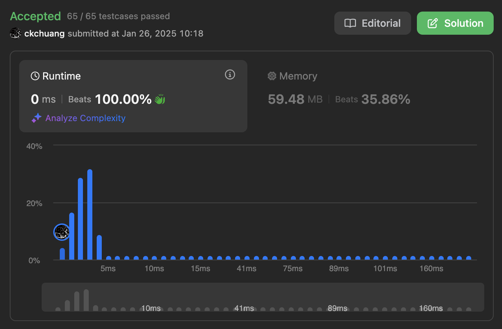

# \[M\] 11. 裝最多水的容器 (Container With Most Water)

## 題目

- [LeetCode 連結](https://leetcode.com/problems/container-with-most-water)
- **主題**：Array, Two Pointers, Greedy
- **難度**：Medium

## 題目描述

給定一個整數陣列 `height`，長度為 `n`。陣列中有 `n` 條豎直的線，`height[i]` 表示第 `i` 條線的高度，其兩端點為 `(i, 0)` 和 `(i, height[i])`。

請找出兩條線，與 x 軸共同構成一個容器，使該容器能夠容納最多的水。

**注意**：容器不能傾斜。

### 範例 1


```plain
輸入：height = [1,8,6,2,5,4,8,3,7]
輸出：49
說明：如圖所示，陣列 [1,8,6,2,5,4,8,3,7] 表示豎直線的高度。在這個例子中，容器能容納最多水（藍色區域）的面積為 49。
```

### 範例 2

```plain
輸入：height = [1,1]
輸出：1
```

### 限制條件

- `n == height.length`
- `2 <= n <= 10^5`
- `0 <= height[i] <= 10^4`

## 問題釐清

- 題目的意思是要求圖片範例的藍色面積，也就是要去找到 X 座標差與相對大的 Y 的相乘中最大的？
- 當輸入陣列為空時，回傳 0？
- 從範例一看到，儘管 8 與 7 兩個高度是 8 比較高，但因為容器的特性，所以這裡的最大高度只能取 7，這樣理解正確？

## 提出測試案例

- 能通過題目的兩個範例
- 空陣列應該回傳 0

## 提出思路

前面提到這題是要去找「`X 座標差` 與 `相對大的 Y` 的相乘中最大值」，所以會需要找到兩個 X 座標間的最大值。

比較暴力是跑兩個迴圈去求每個組合的最大值但應該比較沒效率，所以嘗試用 two pointer 的方式來解：

- 宣告 left、right 分別指向陣列的最左與最右
- 用一個 while loop 不斷檢查當前乘積最大值，並去比較左右兩個高度，比較矮的指標往中間移動，一直到 right >= left 則結束

以註解表示以上的思路：

```ts
function maxArea(height: number[]): number {
  // edge case for empty input

  // declare max multiply
  // declare two pointer to calculate, left equal to index 0, right to last element

  // run a while loop when left < right
    // calculate current max and move pointer
    // move the pointer when smaller than another

  // return result
}
```

## 實作

```ts
function maxArea(height: number[]): number {
  // edge case for empty input
  if (height.length === 0) {
    return 0;
  }
  // declare max multiply
  let max = 0;

  // declare two pointer to calculate
  let left = 0;
  let right = height.length - 1;

  // run a while loop when left < right
  while (left < right) {
    // calculate current max and move pointer
    const currentWidth = right - left;
    const currentHeight = Math.min(height[left], height[right]);
    max = Math.max(max, currentWidth * currentHeight);

    // move the pointer when smaller than another
    if (height[left] < height[right]) {
      left++;
    } else {
      right--;
    }
  }

  // return result
  return max;
}
```

## 撰寫測試

```ts
describe('Container With Most Water', () => {
  test.each([
    {
      input: [1, 8, 6, 2, 5, 4, 8, 3, 7],
      expected: 49
    },
    {
      input: [1, 1],
      expected: 1
    },
    {
      input: [],
      expected: 0
    }
  ])('should return $expected when input is $input', ({ input, expected }) => {
    expect(maxArea(input)).toBe(expected);
  });
});
```

## 複雜度分析

- 時間複雜度：一個迴圈所以是 `O(n)`
- 空間複雜度：只用了常數個變數所以是 `O(1)`

難得用 TypeScript 解可以名列前茅：


