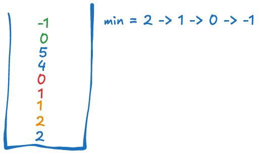

# 226. Invert Binary Tree

# [M] 155. 最小堆疊 (Min Stack)

## 題目

- [LeetCode 連結](https://leetcode.com/problems/min-stack)
- **主題**：Stack
- **難度**：Medium

## 題目描述

設計一個支援以下操作且具備常數時間複雜度的「最小堆疊」（MinStack）：

1. `push(int val)`：將元素 `val` 推入堆疊。
2. `pop()`：移除堆疊頂部的元素。
3. `top()`：獲取堆疊頂部的元素。
4. `getMin()`：檢索堆疊中的最小元素。

實作 `MinStack` 類別：

- **`MinStack()`**：初始化堆疊物件。
- **`void push(int val)`**：將元素 `val` 推入堆疊。
- **`void pop()`**：移除堆疊頂部的元素。
- **`int top()`**：獲取堆疊頂部的元素。
- **`int getMin()`**：檢索堆疊中的最小元素。

要求每個函數操作都必須具備 **O(1)** 的時間複雜度。

### 範例

**輸入：**

```
["MinStack","push","push","push","getMin","pop","top","getMin"]
[[],[-2],[0],[-3],[],[],[],[]]
```

**輸出：**

```
[null,null,null,null,-3,null,0,-2]
```

**解釋：**

```
MinStack minStack = new MinStack();
minStack.push(-2);   // 將 -2 推入堆疊
minStack.push(0);    // 將 0 推入堆疊
minStack.push(-3);   // 將 -3 推入堆疊
minStack.getMin();   // 返回 -3，因為它是堆疊中的最小值
minStack.pop();      // 移除堆疊頂部的 -3
minStack.top();      // 返回 0，因為它現在是堆疊頂部的元素
minStack.getMin();   // 返回 -2，因為它現在是堆疊中的最小值
```

### 限制條件

1. `-2^31 <= val <= 2^31 - 1`
2. `pop`、`top` 和 `getMin` 操作都會在非空堆疊上執行。
3. 最多會進行 3 \* 10⁴ 次的 `push`、`pop`、`top` 和 `getMin` 操作。

## 問題釐清

- top 與 pop 的差別在於只單純得到 stack 頂端的值，而不移除？
- 是否需考慮 stack 中沒值時的狀況？(題目限制中不需考慮)
- 題目要求每個操作都要能是 `O(1)`，這對 push、pop、top 不成問題，但如果要記錄當前最小值的話且要是 `O(1)`，是否代表可以另外宣告一個變數紀錄？

## **提出測試案例**

- 測試題目範例
- 設計在 push 時最小值有替換，並在 pop 時有 pop 到最小值的狀況

## 提出思路

如果用另一個變數紀錄最小值可行的話，實作上會像以下的方式，直接在程式中以註解表示：

```ts
class MinStack {
  constructor() {
    // declare a min value
    // declare a stack
  }

  push(val: number): void {
    // 檢查是否需要更新當前最小值
    // 若需要的話，將舊的最小值先推入 stack，再替換新的最小值
    // 將新值推入 stack
  }

  pop(): void {
    // 檢查當前 pop 出來的值是否與最小值相等
    // 若是，則需要再 pop 前一個次小值到 min 中，才能維持最小值正確性
  }

  top(): number {
    // return the last value from stack
  }

  getMin(): number {
    // return min value
  }
}
```



這個做法一開始想到 pop 時比較有點卡住的是，如果今天「把最小值 pop 出去後，要怎麼得到次小值」，而解法上後來實際畫圖後發現其實若不管當前 stack 長度限制的話，在進行 push 時也需要把次小值先推入 stack 中與新的最小值相鄰，這樣當 pop 出的值是最小時，再次 pop 就能得到次小值。

## 實作

```ts
class MinStack {
  private min: number = Number.MAX_SAFE_INTEGER;
  private stack: number[] = [];

  push(val: number): void {
    // 檢查是否需要更新當前最小值
    if (val <= this.min) {
      // 若需要的話，將舊的最小值先推入 stack，再替換新的最小值
      this.stack.push(this.min);
      this.min = val;
    }
    // 將新值推入 stack
    this.stack.push(val);
  }

  pop(): void {
    // 檢查當前 pop 出來的值是否與最小值相等
    if (this.stack.pop() === this.min) {
      // 若是，則需要再 pop 前一個次小值到 min 中，才能維持最小值正確性
      this.min = this.stack.pop() as number;
    }
  }

  top(): number {
    // return the last value from stack
    return this.stack[this.stack.length - 1];
  }

  getMin(): number {
    // return min value
    return this.min;
  }
}
```

## 撰寫測試

除了題目範例外，這裡另外做一個比較複雜的，確保在有 pop 到最小值時，執行第二次 getMin 與 top 能得到預期的值：

```ts
describe('MinStack', () => {
  it('should return correct value with complex scenario', () => {
    const minStack = new MinStack();
    minStack.push(2);
    minStack.push(1);
    minStack.push(0);
    minStack.push(4);
    minStack.push(5);
    minStack.push(-1);
    expect(minStack.getMin()).toBe(-1);
    minStack.pop();
    expect(minStack.getMin()).toBe(0);
    expect(minStack.top()).toBe(5);
  });
});
```

## 複雜度

因為沒有在 getMin 時另外去搜尋最小值所以每個操作的時間複雜度都是 `O(1)`，空間複雜度大約是 `O(n)`。

另外看到有另一個類似但稍微不同的解法是宣告另一個最小堆疊，用來記錄每次比較後的最小值，而因為也是堆疊結構，就算當前的最小值在主堆疊上被 pop 出去，也能從最小堆疊中取出次小值，但在空間複雜度相較下會多一點。
