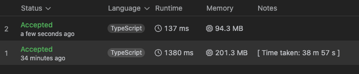

# [M] 1726. 具有相同乘積的元組 (Tuple with Same Product)

## 題目

- [LeetCode 連結](https://leetcode.com/problems/tuple-with-same-product)
- **主題**：Hash Table, Math
- **難度**：Medium
- **Daily**：2025-02-06

## 題目描述

給定一個由 **不同的正整數** 組成的數組 `nums`，請返回 **符合條件的元組 `(a, b, c, d)` 的數量**，其中：

- `a * b = c * d`
- `a, b, c, d` 均來自 `nums`
- `a != b != c != d`

### 範例 1

```plain
輸入：nums = [2,3,4,6]
輸出：8
解釋：
符合條件的 8 個元組：
(2,6,3,4) , (2,6,4,3) , (6,2,3,4) , (6,2,4,3)
(3,4,2,6) , (4,3,2,6) , (3,4,6,2) , (4,3,6,2)
```

### 範例 2

```plain
輸入：nums = [1,2,4,5,10]
輸出：16
解釋：
符合條件的 16 個元組：
(1,10,2,5) , (1,10,5,2) , (10,1,2,5) , (10,1,5,2)
(2,5,1,10) , (2,5,10,1) , (5,2,1,10) , (5,2,10,1)
(2,10,4,5) , (2,10,5,4) , (10,2,4,5) , (10,2,5,4)
(4,5,2,10) , (4,5,10,2) , (5,4,2,10) , (5,4,10,2)
```

### 限制條件

- `1 <= nums.length <= 1000`
- `1 <= nums[i] <= 10^4`
- `nums` 中的所有元素都是 **不同的**

## 問題釐清

- 因為要找四個一組的解，若 `nums` 長度小於 4，是否直接回傳 0？
- 注意：`nums` 裡皆為唯一數字
- 推論：
  - 從範例 1 去推論的話，看起來是否當找到一組解時，相當於有 8 種排列組合
  - 從範例 2 去推論的話，看起來因為找到兩組解，相當於有 8 \* 2 種排列組合
  - 找到 tuple 特殊解數量後 \* 8 即為所求

## 提出思路

- 去找到所有 tuple 特殊解，要怎麼找特殊解？
- 直覺的想法
  - 跑兩個迴圈去計算所有的兩數相乘，並用 hash map 存起來，key 為乘積、value 為 \[x, y\]
  - 確認 hash map 中是否有一組以上的解，有的話去計算每組解的排列組合數量

用註解表示實作的話：

```ts
function tupleSameProduct(nums: number[]): number {
  // handle edge cases
  // declare hash map
  // two-level loop to filled up hash map
  // one loop for hash map keys to find tuples num
  // return result
}
```

## 實作

```ts
function tupleSameProduct(nums: number[]): number {
  // handle edge cases
  if (nums.length < 4) {
    return 0;
  }
  // declare hash map
  const hashMap = new Map<number, number[][]>();
  let tupleCount = 0;

  // two-level loop to filled up hash map
  for (let i = 0; i < nums.length - 1; i++) {
    for (let j = i + 1; j < nums.length; j++) {
      const key = nums[i] * nums[j];
      const target = hashMap.get(key) || [];

      target.push([i, j]);
      hashMap.set(key, target);
    }
  }

  // one loop for hash map keys to find tuples num
  for (let [_, sets] of hashMap) {
    const len = sets.length;

    // 解的組數大於一組，組合數為 (n - 1) + ... + 2 + 1，算出後再乘於 8
    tupleCount += len > 1 ? ((len * (len - 1)) / 2) * 8 : 0;
  }
  // return result
  return tupleCount;
}
```

## 複雜度分析

上面的解法 submit 後不出意外的 runtime 有點太長，但可能因為測資限制在 1000 的長度內，所以沒有 TLE：

- 時間複雜度：主要花在計算每組乘積的雙層迴圈，會是 `O(n²)`
- 空間複雜度：最大的額外空間是 hash map，共會有 `((n * (n - 1)) / 2)` 組乘積，因此也是 `O(n²)`

## 進階挑戰或其他解法探索

主要是把前面的解法存 `[x, y]` 數列的多餘空間拿掉，並直接在當前迴圈中計數，比較不容易想到的是下面註解的地方：

```ts
function tupleSameProductBetter(nums: number[]): number {
  if (nums.length < 4) {
    return 0;
  }

  const productCount = new Map<number, number>();
  let tupleCount = 0;

  for (let i = 0; i < nums.length - 1; i++) {
    for (let j = i + 1; j < nums.length; j++) {
      const product = nums[i] * nums[j];
      const count = productCount.get(product) || 0;

      // 若該乘積已經出現過 count 次，則代表有 count 個不同的數對
      // 可與當前數對 (nums[i], nums[j]) 配對成 8 個有效元組
      tupleCount += count * 8;

      // 更新該乘積的出現次數
      productCount.set(product, count + 1);
    }
  }

  return tupleCount;
}
```

雖然複雜度一樣都還是 `O(n²)`，但仍有改善不少：


