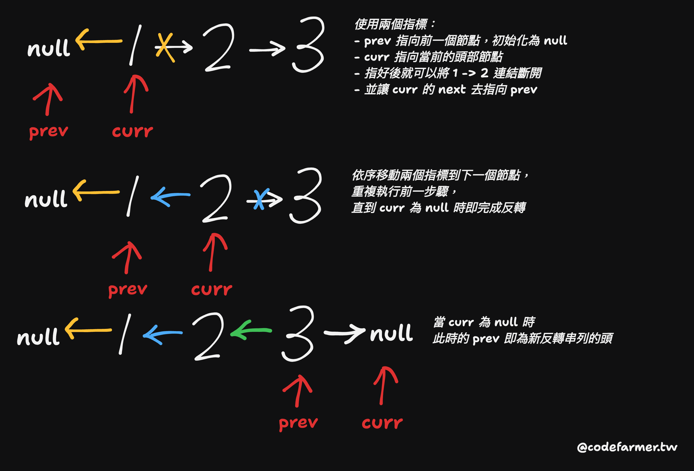

# \[E\] 206. 反轉鏈結串列 (Reverse Linked List)

## 題目

- [LeetCode 連結](https://leetcode.com/problems/reverse-linked-list)
- 主題：Linked List
- 難度：Easy

## 題目描述

給定一個單向鏈結串列的頭節點 `head`，請反轉該鏈結串列，並回傳反轉後的串列。

### 範例 1：

```plain
輸入：head = [1,2,3,4,5]
輸出：[5,4,3,2,1]
```

### 範例 2：

```plain
輸入：head = [1,2]
輸出：[2,1]
```

### 範例 3：

```plain
輸入：head = []
輸出：[]
```

### 限制條件：

- 鏈結串列的節點數量範圍為 `[0, 5000]`。
- `-5000 <= Node.val <= 5000`

### 進階挑戰：

鏈結串列可以透過**迭代**或**遞迴**的方式進行反轉。你能實作這兩種方式嗎？

## 問題釐清

- 輸入型別一定是 ListNode 或空串列的 null 嗎，應該不需要處理不合法輸入？
- 當輸入為 null 時則回傳 null？
- 節點的數量限制在 5000 個內？會需要考慮 stack overflow 的問題嗎？

## 提出測試案例

- 能通過三個範例
- 節點數量的壓測

## 提出思路

如果以程式的簡潔程度來實作的話，使用遞迴應該是最快，但如果需要考量較大量的節點數量可能需要改成迭代的方式。這裡先以遞迴方式實作，如果是遞迴的話，關鍵在於找出 base case 與要執行遞迴的剩餘部份。

如果以一個最簡單的例子 1 → 2 → 3 這樣的串列來做圖解的話，步驟會像是這樣：


因此實作上的思路大概會像這樣：

- 處理 base cases：當 `head` 或 `head.next` 為 `null` 時，代表已經到了尾部，則直接回傳 `head` 這個節點
- 宣告一個新的串列去遞迴處理該節點後的剩餘串列節點
- 反轉當前 `head` 節點的 `head.next.next` 與 `head.next` 指標
- 回傳處理後的新串列的頭部

以註解表示思路的話會像這樣：

```ts
function reverseList(head: ListNode | null): ListNode | null {
  // recursive function base cases, if head or head.next is null, return head
  // declare a new list to reverse remaining list nodes recursively
  // reverse the pointer for current node
  // return new list
}
```

## 實作

```ts
function reverseList(head: ListNode | null): ListNode | null {
  // recursive function base cases, if head or head.next is null, return head
  if (head === null || head.next === null) {
    return head;
  }

  // declare a new list to reverse remaining list nodes recursively
  const newList = reverseList(head.next);

  // reverse the pointer for current node
  head.next.next = head;
  head.next = null;

  // return new list
  return newList;
}
```

## 撰寫測試

沿用之前實作的陣列、串列互轉的 util function，可以簡單用 `test.each` 寫個單元測試像這樣：

```ts
describe('Reverse Linked List', () => {
  test.each([
    { input: [1, 2, 3, 4, 5], expected: [5, 4, 3, 2, 1] },
    { input: [1, 2], expected: [2, 1] },
    { input: [], expected: [] }
  ])('should correctly reverse the list %j', ({ input, expected }) => {
    const head = createLinkedList(input);
    const reversedHead = reverseList(head);
    const result = linkedListToArray(reversedHead);
    expect(result).toEqual(expected);
  });

  test('Stress Test: Reversing a list with 5000 nodes', () => {
    const inputArray = Array.from({ length: 5000 }, (_, i) => i + 1);
    const head = createLinkedList(inputArray);
    const reversedHead = reverseList(head);
    const result = linkedListToArray(reversedHead);
    const expectedArray = inputArray.reverse();
    expect(result).toEqual(expectedArray);
  });
});
```

在壓測這裡如果嘗試去增加節點數會發現遇到 `Maximum call stack size exceeded` 的問題，下面再來嘗試用進階挑戰中提到的迭代方式改寫看看。

## 實作迭代解法

詳細的思路用圖解比較好理解，簡單說就是用兩個指標來依序跑迴圈去不斷重複執行「斷開連結與反轉」直到當前指標指到 null 為止：



實作的話就會像這樣：

```ts
function reverseListIteratively(head: ListNode | null): ListNode | null {
  // if head is null, return null
  if (head === null) {
    return null;
  }

  // declare two pointer to record prev node and curr node
  let prev: ListNode | null = null;
  let curr: ListNode | null = head;

  // run a while loop until curr === null
  while (curr !== null) {
    const tmpNext: ListNode | null = curr.next;

    curr.next = prev;
    prev = curr;
    curr = tmpNext;
  }

  // return prev node as head of new list
  return prev;
}
```

## 複雜度分析

|            | 遞迴                                                        | 迭代                                                                     |
| ---------- | ----------------------------------------------------------- | ------------------------------------------------------------------------ |
| 時間複雜度 | O(N)                                                        | O(N)                                                                     |
| 空間複雜度 | O(N)                                                        | O(1)                                                                     |
| 說明       | 遞迴會佔用額外的 Call Stack，最多會遞迴到 N 層 (節點數量)。 | 只使用了固定數量的變數 (`prev`、`curr`、`tmpNext`)，不會隨著輸入大小增加 |
