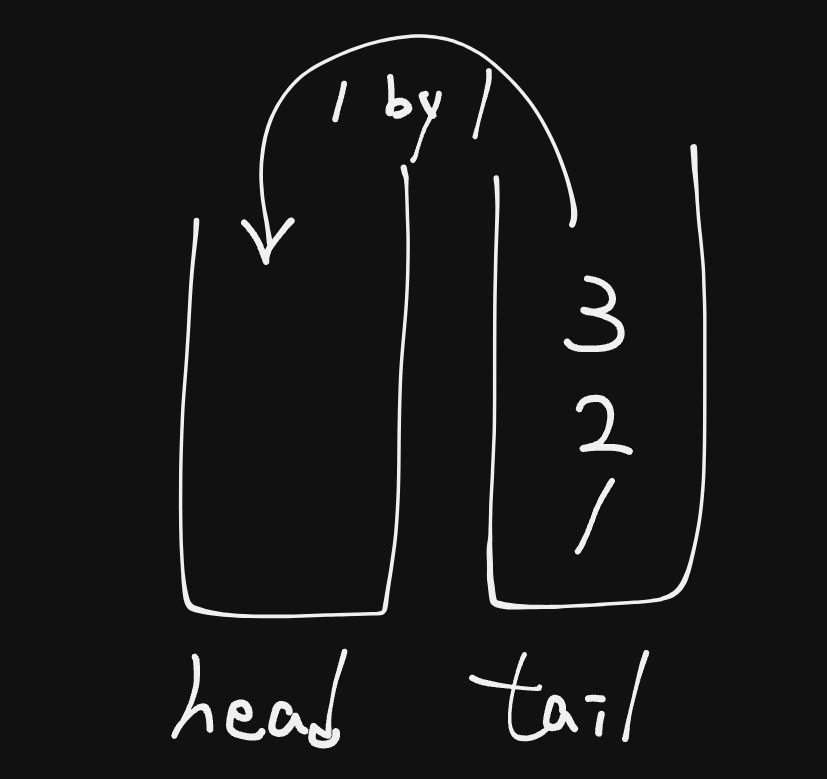

# [E] 232. Implement Queue using Stacks

## 題目

- [LeetCode 連結](https://leetcode.com/problems/implement-queue-using-stacks/)
- **主題**：Stack
- **難度**：Easy

## 題目描述

設計一個僅使用兩個堆疊（stacks）的 **先進先出 (FIFO)** 隊列 (queue) 結構，並實現正常隊列的所有功能，包括以下操作：

1. **`void push(int x)`** 將元素 `x` 推入隊列的尾部。
2. **`int pop()`** 移除並返回隊列的頭部元素。
3. **`int peek()`** 返回隊列頭部的元素。
4. **`boolean empty()`** 如果隊列為空，則返回 `true`；否則返回 `false`。

**注意：**

- 你只能使用堆疊的標準操作，包括：**push 到頂部**、**從頂部 peek/pop**、**檢查大小**和**判斷是否為空**。
- 如果你的程式語言不支援內建的堆疊，你可以使用列表（list）或雙端隊列（deque）來模擬堆疊，但只能使用堆疊的標準操作。

### **範例**

**輸入：**

```
["MyQueue", "push", "push", "peek", "pop", "empty"]
[[], [1], [2], [], [], []]
```

**輸出：**

```
[null, null, null, 1, 1, false]
```

**解釋：**

```
MyQueue myQueue = new MyQueue();
myQueue.push(1); // 隊列為: [1]
myQueue.push(2); // 隊列為: [1, 2]（左邊是隊列頭部）
myQueue.peek();  // 返回 1
myQueue.pop();   // 返回 1，隊列變為 [2]
myQueue.empty(); // 返回 false
```

### **限制條件**

1. `1 <= x <= 9`
2. 對 `push`, `pop`, `peek`, 和 `empty` 的調用次數最多為 `100` 次。
3. 所有對 `pop` 和 `peek` 的調用都是有效的（即在調用之前隊列不為空）。

### **進階挑戰**

你能否實現所有操作的**攤銷 ([amortized](https://en.wikipedia.org/wiki/Amortized_analysis)) 時間複雜度為 O(1)**？換句話說，執行 `n` 個操作的總時間為 `O(n)`，即使某些操作可能需要更長的時間。

## 問題釐清

- 因為是要模擬 queue 的行為，所以這裡的 push 指的是 enqueue、pop 指的是 dequeue，為了避免溝通混肴，以下是否可以改名成 `enqueue` 與 `dequeue`
- 執行 enqueue 後是否不需回傳任何值？
- 執行 peek 後是只要回傳當前 queue 的首位值而已，不需移除對吧？
- 當 queue 為空時，執行 dequeue 或 peek 時是否需回傳 null 視為不存在？
- 「只能使用堆疊的標準操作」，以 JavaScript 來說就是只能用 array 的 push、pop 兩個方法，而不能用 shift、unshift？那 concat 可以用嗎？

## **提出測試案例**

- 測試範例的基本案例能回傳正確值
- 當 queue 為空時，執行 dequeue 與 peek 也不會噴錯

## 提出思路



因為是需要用兩個 stack 來模擬 queue 的結構，所以在執行每個要參考 queue 頭部的操作 dequeue 與 peek 時會需要多一些判斷來調整資料順序：

- 宣告 head、tail 兩個 stack array：
  - head 模擬 queue 的頭部
  - tail 負責放入新推入的值
- enqueue：將值直接推入 tail 中
- dequeue：檢查 head 中是否有值
  - 是：pop 出 head 堆疊中的上方元素
  - 否：檢查 tail 是否有值
    - 是：一個一個 pop 出來並 push 到 head 中，再 pop 出 head 堆疊中的上方元素
    - 否：回傳 null
- peek：同 dequeue 邏輯，但只讀取 head 的最末端元素值不執行 pop
- empty：檢查兩個 stack 是否皆為空

以註解表示，這裡因為 dequeue 與 peek 有相同邏輯，另外抽成一個 static method 來避免重複：

```ts
class MyQueue {
  // declare head and tail stack arrays
  constructor() {}

  enqueue(x: number): void {
    // push x into tail directly
  }

  // implement a private method to manipulate two stack for `dequeue` adn `peek`
  private swapStack() {
    // check and swap values from tail to head
  }

  dequeue(): number {
    // check empty status, if true, return null
    // do swapCheck
    // return and pop value from head
  }

  peek(): number {
    // check empty status, if true, return null
    // do swapCheck
    // return value from head
  }

  empty(): boolean {
    // check if two stack are all empty
  }
}
```

## 實作

根據上述的註解來實作，實作完後將原本 enqueue 與 dequeue 改回 push 與 pop 符合題目要求：

```ts
export class MyQueue {
  // declare head and tail stack arrays
  private head: number[];
  private tail: number[];

  constructor() {
    this.head = [];
    this.tail = [];
  }

  push(x: number): void {
    // push x into tail directly
    this.tail.push(x);
  }

  // implement a private method to manipulate two stack for `dequeue` adn `peek`
  private swapStack(): void {
    // check and swap values from tail to head
    const { head, tail } = this;

    if (head.length === 0) {
      while (tail.length !== 0) {
        head.push(tail.pop() as number);
      }
    }
  }

  pop(): number | null {
    // check empty status, if true, return null
    if (this.empty()) {
      return null;
    }
    // do swapCheck
    this.swapStack();

    // return and pop value from head
    const headValue = this.head.pop() as number;

    return headValue;
  }

  peek(): number | null {
    // check empty status, if true, return null
    if (this.empty()) {
      return null;
    }
    // do swapCheck
    this.swapStack();

    // return value from head
    return this.head[this.head.length - 1];
  }

  empty(): boolean {
    // check if two stack are all empty
    return this.head.length === 0 && this.tail.length === 0;
  }
}
```

## 關於進階挑戰

在題目的進階挑戰中提到希望可能在某些操作像是 `pop` 與 `peek` 時，只有在 head 為空的狀況下才會做交換 stack 資料，而讓時間複雜度到 `O(N)`，但其他狀況與 `push` 與 `empty` 都是 `O(1)`，所以在操作夠平均下來理論上能接近 `O(1)`。

那怎樣會讓進階挑戰不成立呢，可能就像是連 `push` 都去做交換 stack 的資料，每次都組合成 queue 的模樣，就會讓攤銷下來的時間接近 `O(N)`。
