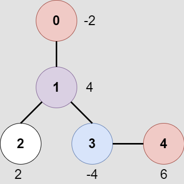
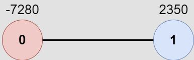

# [M] 2467. Most Profitable Path in a Tree

## 題目

- [LeetCode 連結](https://leetcode.com/problems/most-profitable-path-in-a-tree)
- **主題**：Tree, DFS, BFS, Graph
- **難度**：Medium (Rating: 2053)
- **Daily**：2025-02-24

## 題目描述

有一個無向樹，包含 `n` 個節點，標號從 `0` 到 `n - 1`，根節點為節點 `0`。給定一個長度為 `n - 1` 的二維整數陣列 `edges`，其中 `edges[i] = [a_i, b_i]` 表示節點 `a_i` 和節點 `b_i` 之間有一條邊。

在每個節點 `i` 處都有一扇門。你還得到一個全為偶數的陣列 `amount`，其中 `amount[i]` 表示：

- 如果 `amount[i]` 是負數，表示打開節點 `i` 處的門需要支付的費用。
- 如果 `amount[i]` 是正數，表示打開節點 `i` 處的門可以獲得的獎勵。

遊戲規則如下：

- 起初，Alice 位於節點 `0`，Bob 位於節點 `bob`。
- 每秒，Alice 和 Bob 各自移動到相鄰的節點。Alice 朝著某個葉子節點移動，而 Bob 朝著節點 `0` 移動。
- 對於他們路徑上的每個節點，Alice 和 Bob 要麼支付費用打開門，要麼獲得獎勵。注意：
  - 如果門已經被打開，則不需要再次支付費用或獲得獎勵。
  - 如果 Alice 和 Bob 同時到達一個節點，他們會平分打開門的費用或獎勵。換句話說，如果打開門的費用是 `c`，那麼 Alice 和 Bob 各自支付 `c / 2`。同樣，如果獎勵是 `c`，他們各自獲得 `c / 2`。
- 如果 Alice 到達一個葉子節點，她停止移動。同樣地，如果 Bob 到達節點 `0`，他停止移動。注意，這些事件是相互獨立的。

請返回 Alice 朝著最優葉子節點移動時可以獲得的最大淨收入。

### 範例 1



```plain
輸入：edges = [[0,1],[1,2],[1,3],[3,4]], bob = 3, amount = [-2,4,2,-4,6]
輸出：6
解釋：
上圖展示了給定的樹。遊戲過程如下：
- Alice 起初在節點 0，Bob 在節點 3。他們打開各自所在節點的門。
  Alice 的淨收入現在是 -2。
- Alice 和 Bob 都移動到節點 1。
  由於他們同時到達這個節點，他們一起打開門並平分獎勵。
  Alice 的淨收入變為 -2 + (4 / 2) = 0。
- Alice 移動到節點 3。由於 Bob 已經打開了這扇門，Alice 的收入保持不變。
  Bob 移動到節點 0，並停止移動。
- Alice 移動到節點 4 並打開那裡的門。她的淨收入變為 0 + 6 = 6。
現在，Alice 和 Bob 都無法再進行任何移動，遊戲結束。
Alice 無法獲得更高的淨收入。
```

### 範例 2



```plain
輸入：edges = [[0,1]], bob = 1, amount = [-7280,2350]
輸出：-7280
解釋：
Alice 按照路徑 0->1 移動，而 Bob 按照路徑 1->0 移動。
因此，Alice 只打開了節點 0 處的門。她的淨收入是 -7280。
```

### 限制條件

- `2 <= n <= 10^5`
- `edges.length == n - 1`
- `edges[i].length == 2`
- `0 <= a_i, b_i < n`
- `a_i != b_i`
- `edges` 表示一棵有效的樹。
- `1 <= bob < n`
- `amount.length == n`
- `amount[i]` 是範圍 `[-10^4, 10^4]` 之間的偶數。

---

## 解題思路

題目有點長，先簡單理解下：

- 根據輸入得到樹的樣貌與每個點的權重
- Alice 固定從 0 出發，朝某個葉節點前進，出發時需要打開當前節點的門
- Bob 從輸入的 `bob` 出發，朝向 0 前進，出發時需要打開當前節點的門
- 每當訪問某個節點時，獲取收入的規則如下：
  - 若某個玩家先到達該節點，他可獲得該節點的全部收入。
  - 若兩人同時到達，則平分該節點的收入。
  - 若該節點已被另一人先訪問，則無法再獲取收入。
- 最後目標是找到 Alice 選擇最佳的葉子節點路徑，以獲得最大的淨收入

看到 rating 2053 感覺有點不妙，想了下後參考官方教學做筆記，先了解下兩個 DFS 的版本。

## 解法：兩個 DFS

- 先用 edges 找出每個點的鄰點
- 第一個 DFS：找到 Bob 經過每個點的時間
  - 因為 Bob 只有一條固定的最短路徑前往 node 0，可以先用 DFS 找到 Bob 經過每個點的時間，用一個 map 記錄下來
- 第二個 DFS：找到 Alice 的最佳路徑
  - 傳入三個參數：節點位置、時間、當前累積收入
  - 根據節點與時間與 Bob 的 time map 比對，來計算當前收入的算法
  - 確認當前節點是否為葉節點，若是則比對當前最大值
  - 用一個 for 迴圈往下個鄰點遞迴

## 實作

```ts
function mostProfitablePath(
  edges: number[][],
  bob: number,
  amount: number[]
): number {
  const n = amount.length;
  const tree: Set<number>[] = Array.from({ length: n }, () => new Set());
  const visited = Array.from({ length: n }, () => false);
  const bobNodeToTime = new Map<number, number>();
  let maxIncome = -Infinity;

  // 依照 edges 來找到每個鄰點
  for (const [u, v] of edges) {
    tree[u].add(v);
    tree[v].add(u);
  }

  // 用 DFS 遞迴來記錄 Bob 的路徑與到達時間
  function findBobPath(node: number, time: number): boolean {
    bobNodeToTime.set(node, time);
    visited[node] = true;

    if (node === 0) return true;

    // 沿著當前節點的每個鄰點前進去遞迴
    for (const neighbor of tree[node]) {
      if (!visited[neighbor] && findBobPath(neighbor, time + 1)) {
        return true;
      }
    }

    // 無法到達 node 0 或非最佳路徑
    bobNodeToTime.delete(node);
    return false;
  }

  findBobPath(bob, 0);

  // 用 DFS 計算 Alice 的最佳路徑
  function findAlicePath(node: number, time: number, income: number): void {
    visited[node] = true;
    let newIncome = income;

    if (!bobNodeToTime.has(node) || bobNodeToTime.get(node)! > time) {
      // Alice 先到，獲取全部
      newIncome += amount[node];
    } else if (bobNodeToTime.get(node) === time) {
      // 同時到達，平分收入
      newIncome += amount[node] / 2;
    }

    // 若是葉子節點，計算當前最大收入是否計入
    if (tree[node].size === 1 && node !== 0) {
      maxIncome = Math.max(maxIncome, newIncome);
    }

    // DFS 遞迴找到葉節點的路徑
    for (const neighbor of tree[node]) {
      if (!visited[neighbor]) {
        findAlicePath(neighbor, time + 1, newIncome);
      }
    }
  }

  // reset visited array 來做 Alice 的 DFS
  visited.fill(false);
  findAlicePath(0, 0, 0);

  return maxIncome;
}
```

## 複雜度分析

假設 `n` 代表樹上的節點數：

- 時間複雜度
  - 建立鄰點表：`O(n)`
  - 計算 Bob time map 的 DFS，因為每個點只會被造訪一次所以應為 `O(n)`
  - 計算 Alice 最佳路徑的 DFS，因為每個點只會被造訪一次所以應為 `O(n)`
  - 最後總計為 `O(n)`
- 空間複雜度
  - 鄰點表中，是把兩個點之間的邊都推入該點為 key 的 set 中，整顆樹最多的邊數為 `n - 1`，也就是總共佔用了 `2(n - 1)` 的空間，因此為 `O(n)`
  - `visited` 陣列佔用 `O(n)`
  - 兩個 DFS 的遞迴深度最深都為 `O(n)`
  - Bob 的 time map 最多也佔 `O(n)`
  - 最後總計為 `O(n)`

## 其他解法

從官方教學上看起來，還有兩種做法，時間不夠之後有回頭複習再來看看：

- 空間更複雜一些：DFS 找 Bob time map、BFS 找 Alice 最佳解
- 進階：一次 DFS 做完

## 彩蛋

這個留言真的很有創意：


