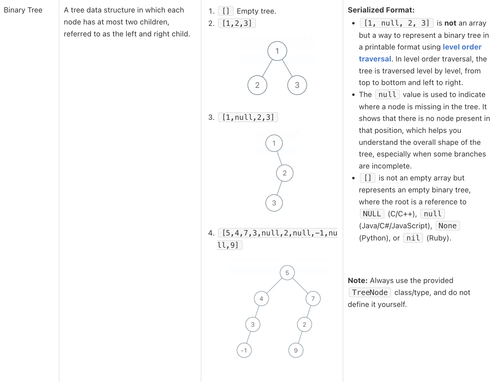

# 297. 序列化與反序列化二元樹 (Serialize and Deserialize Binary Tree)

## 題目

- [LeetCode 連結](https://leetcode.com/problems/serialize-and-deserialize-binary-tree)
- 主題：Binary Tree
- 難度：Hard

## 題目描述

序列化是將資料結構或物件轉換為位元序列的過程，以便將其儲存於檔案或記憶體緩衝區中，或透過網路連線進行傳輸，稍後在相同或其他環境中重組。


請設計一種演算法來序列化和反序列化二元樹。沒有任何限制此演算法如何運作，只要你的序列化/反序列化演算法確保能將二元樹序列化為字串，並且能從該字串正確地反序列化為原始的樹結構。


**說明**：輸入/輸出的格式可以與 [LeetCode 的二元樹序列化](https://support.leetcode.com/hc/en-us/articles/32442719377939-How-to-create-test-cases-on-LeetCode#h_01J5EGREAW3NAEJ14XC07GRW1A)格式相同。你不需要完全遵循該格式，可以發揮創意並提出不同的解法。



---

### 範例 1：


```plain
輸入：root = [1,2,3,null,null,4,5]
輸出：[1,2,3,null,null,4,5]
```

### 範例 2：

```plain
輸入：root = []
輸出：[]
```

### **限制條件**：

- 樹中結點的數量範圍為 `[0, 10⁴]`。
- 每個結點的值範圍為 `-1000 <= Node.val <= 1000`。

## 問題釐清

- 簡單理解題意的話，會希望去完成兩個函式，讓一個二元樹在經過 `serialize` 後成字串後，再把該字串傳入 `deserialize` 可以得到原本的二元樹，這樣理解沒錯吧？
- 如果用 TypeScript 去實作的話，把這個可以做序列化、反序列化的功能做成一個像是 TreeCodec 的 class 可能會更好維護？
- 確認 `serialize` 函式：
   - 輸入的型別部份限制為 TreeNode 或 null 即可，或需要處理其他不符合需求的格式做錯誤處理？
   - 輸入的 TreeNode 中的值可以限制為 number，不需對其他非預期格式做處理？
   - 當輸入中含有負值，則輸出可能會像是 `-1,2,-3,n,n,-4,5` 這樣？
   - 輸出的部份一律為字串？
   - 輸出的字串格式參考範例一的話，是否一定要像是 `[1,2,3,null,null,4,5]` 的格式，或也可以簡化像是 `1,2,3,n,n,4,5` 即可？
   - 當輸入的樹在最後一層中只有一個最左邊的節點，則輸出字串中是否需移除連續的空值，像是 `1,2,3,4,n,n,n`  其實只需要 `1,2,3,4` 即可
   - 當輸入為 null 時，則輸出空字串？
- 確認 `deserialize` 函式：
   - 輸入的型別部份限制為只有字串，會需要處理其他不符合需求的格式做錯誤處理？
   - 輸出的部份為 TreeNode 或 null？
   - 當輸入為空字串時，則輸出 null？

## 提出測試案例

- 基本測資能將範例一的 `[1,2,3,null,null,4,5]` 做序列化、反序列化後能得到同樣的 tree
- 確認空樹在序列化後得到空字串、將空字串反序列化後得到空樹 (null)
- 測試最後一層只有最左邊一個節點時，序列化後不會有連續的 n 字串
- 檢查含有負值的樹也能正確運作
- 檢查 root 節點值為 0 的狀況
- 檢查節點數為 10000 的只有右節點的樹能正確運作
- 檢查節點數接近 10000 的 complete binary tree 能正確運作

## 提出思路

定義好上述序列化與反序列化的規則後，可以視為逐層遍歷與字串處理問題：

- 定義 `TreeCodec` 的 class，裡面包含 `serialize` 與 `deerialize` 兩個函式
- 序列化
   - 若輸入為 null，回傳空字串
   - 遍歷的演算法可以像做 Level Order Traversal 一樣用 BFS 來解
   - 宣告一個 queue 來儲存每一層樹節點，跑迴圈來遍歷直到 queue 為空
   - 依照類似 `-1,2,-3,n,n,-4,5` 這樣的規則來輸出序列化字串資料，n 代表空節點，且可能有負數值
   - 移除多餘的連續空值
   - 組合字串陣列並以 `,` 做分隔
   - 返回結果字串
- 反序列化
   - 若輸入為空字串，回傳 null
   - 對輸入字串用 `,` 符號做 split 得到節點值的陣列
   - 對該字串陣列值做處理，遇到 `n` 則視為空節點 null，否則轉為數字
   - 用 queue 儲存當前待處理的節點，並跑迴圈用 top down 的方式來逐層組合輸出的二元樹，直到 queue 為空則停止
   - 返回結果二元樹

以註解表示：

```ts
// declare a TreeCodec class including following two functions

/*
 * Encodes a tree to a single string.
 */
function serialize(root: TreeNode | null): string {
  // if root is null, return empty string
  // declare a result string array
  // declare a queue to do level order traversal, init with root value

  // run a while loop when queue is not empty
    // dequeue to get current node
    // if current node not null
      // push value into result
      // enqueue left node and right node
    // push null value

  // remove redundant null value at tail
  // return serialized string by joining with `,`
}

/*
 * Decodes your encoded data to tree.
 */
function deserialize(data: string): TreeNode | null {
  // if data is empty string, return null

  // split string by `,`
  // transform each value to null or number
  // declare result tree
  // declare a queue, init with first node

  // run a while loop when queue is not empty
    // dequeue current node
    // assign next value as left node if it's not null
    // assign next value as right node if it's not null

  // return result tree
}
```

## 實作

將上述的思路實作後會像以下的程式：

```ts
// declare a TreeCodec class including following two functions
class TreeCodec {
  /*
   * Encodes a tree to a single string.
   */
  serialize(root: TreeNode | null): string {
    // if root is null, return empty string
    if (root === null) {
      return '';
    }

    // declare a result string array
    const result: string[] = [];

    // declare a queue to do level order traversal, init with root value
    const queue: (TreeNode | null)[] = [root];

    // run a while loop when queue is not empty
    while (queue.length > 0) {
      // dequeue to get current node
      const currentNode = queue.shift();

      // if current node not null
      if (currentNode) {
        // push value into result
        result.push(currentNode.val.toString());
        // enqueue left node and right node
        queue.push(currentNode.left);
        queue.push(currentNode.right);
      } else {
        result.push('n');
      }
    }

    // remove redundant null value at tail
    while (result[result.length - 1] === 'n') {
      result.pop();
    }

    // return serialized string by joining with `,`
    return result.join(',');
  }

  /*
   * Decodes your encoded data to tree.
   */
  deserialize(data: string): TreeNode | null {
    // if data is empty string, return null
    if (data === '') {
      return null;
    }

    // split string by `,`
    // transform each value to null or number
    const values = data.split(',').map((v) => (v === 'n' ? null : Number(v)));

    // preventing wrong data format with empty root value
    if (typeof values[0] !== 'number') {
      throw new Error('wrong input data');
    }

    // declare result tree
    const root = new TreeNode(values[0]);
    // declare a queue, init with first node
    const queue = [root];
    let currentIndex = 1;

    // run a while loop when queue is not empty
    while (queue.length > 0) {
      // dequeue current node
      const node = queue.shift() as TreeNode;
      // assign next value as left node if it's not null
      if (typeof values[currentIndex] === 'number') {
        node.left = new TreeNode(values[currentIndex]!);
        queue.push(node.left);
      }
      currentIndex++;

      // assign next value as right node if it's not null
      if (typeof values[currentIndex] === 'number') {
        node.right = new TreeNode(values[currentIndex]!);
        queue.push(node.right);
      }
      currentIndex++;
    }

    // return result tree
    return root;
  }
}
```

試著將這段程式中的兩個函式放到 leetcode 上去 submit 可以通過，以下試著來根據上面的測試案例實作單元測試。

## 撰寫單元測試

```ts
describe('Serialize and Deserialize Binary Tree', () => {
  const codec = new TreeCodec();

  it('should correctly serialize and deserialize for example 1', () => {
    const root = new TreeNode(
      1,
      new TreeNode(2),
      new TreeNode(3, new TreeNode(4), new TreeNode(5))
    );
    const serialized = codec.serialize(root);
    const deserialized = codec.deserialize(serialized);

    expect(serialized).toEqual('1,2,3,n,n,4,5');
    expect(deserialized).toEqual(root);
  });

  it('should handle empty tree for example 2', () => {
    const root = null;
    const serialized = codec.serialize(root);
    const deserialized = codec.deserialize(serialized);

    expect(serialized).toEqual('');
    expect(deserialized).toBeNull();
  });

  it('should handle tree with only leftmost node in the last level', () => {
    const root = new TreeNode(
      1,
      new TreeNode(2, new TreeNode(4)),
      new TreeNode(3)
    );
    const serialized = codec.serialize(root);

    expect(serialized).toEqual('1,2,3,4');
  });

  it('should handle tree with negative values', () => {
    const root = new TreeNode(
      -1,
      new TreeNode(-2),
      new TreeNode(-3, new TreeNode(-4), new TreeNode(-5))
    );
    const serialized = codec.serialize(root);
    const deserialized = codec.deserialize(serialized);

    expect(serialized).toEqual('-1,-2,-3,n,n,-4,-5');
    expect(deserialized).toEqual(root);
  });

  it('should handle tree with root value of 0', () => {
    const root = new TreeNode(0, new TreeNode(-1), new TreeNode(1));
    const serialized = codec.serialize(root);
    const deserialized = codec.deserialize(serialized);

    expect(serialized).toEqual('0,-1,1');
    expect(deserialized).toEqual(root);
  });

  it('should handle tree with 10000 nodes having only left children', () => {
    const root = new TreeNode(1);
    let current = root;

    for (let i = 2; i <= 10000; i++) {
      const newNode = new TreeNode(i);
      current.left = newNode;
      current = newNode;
    }

    const serialized = codec.serialize(root);
    const deserialized = codec.deserialize(serialized);

    expect(serialized.startsWith('1,2,n,3,n,4,n')).toBeTruthy();
    expect(deserialized).toEqual(root);
  });

  it('should handle a complete binary tree with lots of nodes', () => {
    const createCompleteBinaryTree = (n: number): TreeNode | null => {
      if (n === 0) return null;
      const nodes = Array.from({ length: n }, (_, i) => new TreeNode(i + 1));
      for (let i = 0; i < Math.floor(n / 2); i++) {
        if (2 * i + 1 < n) nodes[i].left = nodes[2 * i + 1];
        if (2 * i + 2 < n) nodes[i].right = nodes[2 * i + 2];
      }
      return nodes[0];
    };

    const root = createCompleteBinaryTree(10000);
    const serialized = codec.serialize(root);
    const deserialized = codec.deserialize(serialized);

    expect(deserialized).toEqual(root);
  });
});
```

這裡實際去執行測試後，只有倒數第二個這個左側一條深層的樹會遇到 `RangeError: Maximum call stack size exceeded` 的 stack overflow 問題而失敗。

先試著把反序列化的部份註解掉就能正常通過了，所以效能瓶頸是發生在 `deserialized` 的地方，試著做一些特製的邊界條件去調整後問題還是存在，後來在想有可能是原本 Vitest 設定可能有一些效能相關的問題。

找到一個 [pool](https://vitest.dev/guide/improving-performance.html#pool) 的設定，試著調整成 `pool: ‘threads'` 就通過了，研究了下文件看起來預設是使用 `pool: 'forks'` 的方式，也就是將每個測試跑在不同的 `node:child_process`，而若有效能問題，文件建議可以改成用 `node:worker_threads` 的方式改善。

又好奇去看這是不是只有 Vitest 特製的設定，找到 jest 中也有一個 [workerThreads](https://jestjs.io/docs/29.5/configuration#workerthreads) 的設定，關於這兩者的差別還沒太深入研究，先筆記在這。