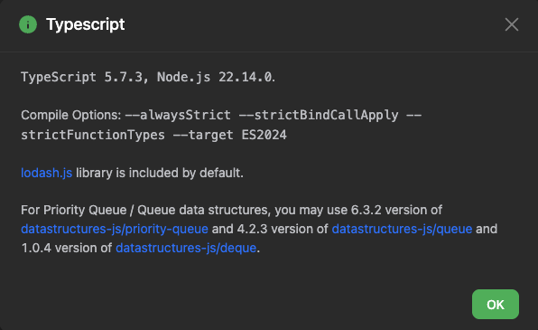

# [M] 3066. Minimum Operations to Exceed Threshold Value II

## 題目

- [LeetCode 連結](https://leetcode.com/problems/minimum-operations-to-exceed-threshold-value-ii)
- **主題**：Heap (Priority Queue)
- **難度**：Medium
- **Daily**：2025-02-13

## 題目描述

給定一個 **0 索引** 的整數數組 `nums`，以及一個整數 `k`。

每次操作，你可以執行以下步驟：

1. 取出 `nums` 中最小的兩個整數 `x` 和 `y`。
2. 從 `nums` 中移除 `x` 和 `y`。
3. 將 `min(x, y) * 2 + max(x, y)` 添加回 `nums`。

請注意，當 `nums` 至少包含兩個元素時，才能執行上述操作。請返回使得 `nums` 中所有元素都大於等於 `k` 所需的**最少操作次數**。

### 範例 1

```plain
輸入：nums = [2,11,10,1,3], k = 10
輸出：2
解釋：
- 第一次操作，移除 `1` 和 `2`，然後加入 `1 * 2 + 2 = 4`，nums 變為 `[4, 11, 10, 3]`。
- 第二次操作，移除 `3` 和 `4`，然後加入 `3 * 2 + 4 = 10`，nums 變為 `[10, 11, 10]`。
- 此時所有數字都大於等於 `10`，可以停止操作。
最少需要 2 次操作使所有數字都大於等於 `10`。
```

### 範例 2

```plain
輸入：nums = [1,1,2,4,9], k = 20
輸出：4
解釋：
- 第一次操作後，nums 變為 `[2, 4, 9, 3]`。
- 第二次操作後，nums 變為 `[7, 4, 9]`。
- 第三次操作後，nums 變為 `[15, 9]`。
- 第四次操作後，nums 變為 `[33]`。
- 此時所有數字都大於等於 `20`，可以停止操作。
最少需要 4 次操作使所有數字都大於等於 `20`。
```

### 限制條件

- `2 <= nums.length <= 2 * 10^5`
- `1 <= nums[i] <= 10^9`
- `1 <= k <= 10^9`
- 輸入保證一定存在解，即總能透過某種操作順序，使所有元素大於等於 `k`。

---

## 問題釐清

- 雖然題目限制一定存在符合 k 值條件的解，但為了處理邊界條件，若像是 `nums` 長度小於 2 或找不到解則回傳 `-1` 是否可行？

## 提出思路

這題如果不使用 min heap 來實作的話，直覺應該會是用各種陣列方法來做暴力解，也就是在 while 迴圈中不斷地插入、刪除、檢查當前最小值是否大於等於 k。

而如果能將一開始的 `nums` 轉成 min heap 的結構，主程式的邏輯就簡潔許多了，效能也好。

## 實作

稍微學了一下基礎 priority queue 與 heap 的概念後，才發現原來像是 Python 的 `heapq`、C++ 的 `priority_queue`、Java、Go 這些語言都有內建 heap 的資料結構，而如果使用 JavaScript/TypeScript 的話，很抱歉，這需要自己實作，甚至有個專門的套件 ([@datastructures-js/heap](https://github.com/datastructures-js/heap)、[@datastructures-js/priority-queue](https://github.com/datastructures-js/priority-queue)) 能直接調用。

> 2025-03-15 補充：後來經過[古古](https://kucw.io/)的友情提醒與研究，發現如果是使用 LeetCode 並搭配 JavaScript/TypeScript 進行 PQ 相關的解題時，預設平台是會自動載入上述兩個套件輔助更方便善用像是 min heap 或 max heap 的資料結構 ([ref](https://support.leetcode.com/hc/en-us/articles/360011833974-What-are-the-environments-for-the-programming-languages))。而 Python 有另一個限制是原生並沒有提供 max heap，查了下資訊看起來會需要調整成負數形式來用 min heap 實作。



有鑒於上面的補充，直接來嘗試看看使用套件的版本 (LeetCode 上套件版本在 TypeScript 型別編譯上另有差異，需拿掉泛型)：

```ts
import { MinPriorityQueue } from '@datastructures-js/priority-queue';

function minOperations(nums: number[], k: number): number {
  // handle edge case
  if (nums.length < 2) {
    return -1;
  }

  // arrange nums with min heap
  const pq = new MinPriorityQueue<number>();

  nums.forEach(num => pq.enqueue(num));

  let count = 0;

  // run while loop until array length smaller than h
  // check whether all new nums larger or equal to k
  while (pq.size() >= 2 && pq.front()! < k) {
    const x = pq.dequeue()!;
    const y = pq.dequeue()!;
    const newNum = Math.min(x, y) * 2 + Math.max(x, y);
    pq.enqueue(newNum);
    count++;
  }

  // return minimum operation count
  return count;
}
```

### 純手工實作

雖然實際在 LeetCode 上解題可以直接用套件，還是保留下原本的筆記，如果要純手工實作一個簡單版的 MinHeap class 的話會長這樣：

```ts
// @/types/Heap.ts
export class MinHeap<T> {
  private heap: T[] = [];

  private getParentIndex(i: number): number {
    return Math.floor((i - 1) / 2);
  }

  private getLeftChildIndex(i: number): number {
    return 2 * i + 1;
  }

  private getRightChildIndex(i: number): number {
    return 2 * i + 2;
  }

  private swap(i: number, j: number): void {
    [this.heap[i], this.heap[j]] = [this.heap[j], this.heap[i]];
  }

  private heapifyUp(): void {
    let index = this.heap.length - 1;
    while (index > 0) {
      const parentIndex = this.getParentIndex(index);
      if (this.heap[index] >= this.heap[parentIndex]) break;
      this.swap(index, parentIndex);
      index = parentIndex;
    }
  }

  private heapifyDown(): void {
    let index = 0;
    while (this.getLeftChildIndex(index) < this.heap.length) {
      let smallerChildIndex = this.getLeftChildIndex(index);
      const rightChildIndex = this.getRightChildIndex(index);

      if (
        rightChildIndex < this.heap.length &&
        this.heap[rightChildIndex] < this.heap[smallerChildIndex]
      ) {
        smallerChildIndex = rightChildIndex;
      }

      if (this.heap[index] <= this.heap[smallerChildIndex]) break;

      this.swap(index, smallerChildIndex);
      index = smallerChildIndex;
    }
  }

  push(value: T): void {
    this.heap.push(value);
    this.heapifyUp();
  }

  pop(): T | undefined {
    if (this.heap.length === 0) return undefined;
    if (this.heap.length === 1) return this.heap.pop();

    const minValue = this.heap[0];
    this.heap[0] = this.heap.pop()!;
    this.heapifyDown();
    return minValue;
  }

  peek(): T | undefined {
    return this.heap[0];
  }

  size(): number {
    return this.heap.length;
  }

  isEmpty(): boolean {
    return this.heap.length === 0;
  }
}
```

有個這個結構後，就能來實作這一題：

```ts
import { MinHeap } from '@/types/Heap';

function minOperations(nums: number[], k: number): number {
  // handle edge case
  if (nums.length < 2) {
    return -1;
  }

  // declare new nums array
  const heap = new MinHeap<number>();

  for (let num of nums) {
    heap.push(num);
  }

  let count = 0;
  // run while loop until array length smaller than h
  // check whether all new nums larger or equal to k
  while (heap.size() >= 2 && heap.peek()! < k) {
    const x = heap.pop()!;
    const y = heap.pop()!;
    const newNum = Math.min(x, y) * 2 + Math.max(x, y);

    heap.push(newNum);
    count++;
  }

  // return minimum operation count
  return heap.peek()! < k ? -1 : count;
}
```

## 複雜度分析

若 `N` 代表 `nums` 長度：

- 時間複雜度：`O(NlogN)`
  - 建立 min heap 結構：每次插入元素是 `O(logN)`，執行 N 次所以是 `O(NlogN)`
  - while 迴圈：
    - 取最小值 (peek) 時是 `O(1)`
    - 每次 pop 最小值是 `O(logN)`
    - 每次 push 新計算的值是 `O(logN)`
    - 迴圈執行次數接近 N 次，因此總計為 `O(NlogN)`
- 空間複雜度：另外用了一個 heap 來處理為 `O(N)`
