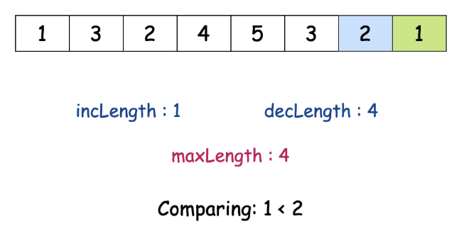

# [E] 3105. 最長嚴格遞增或遞減子陣列 (Longest Strictly Increasing or Strictly Decreasing Subarray)

## 題目

- [LeetCode 連結](https://leetcode.com/problems/longest-strictly-increasing-or-strictly-decreasing-subarray)
- **主題**：Array
- **難度**：Easy

## 題目描述

給定一個整數陣列 `nums`，請返回 `nums` 中 **最長的** 嚴格遞增或嚴格遞減的 **子陣列** 的長度。

### 範例 1

```
輸入：nums = [1,4,3,3,2]
輸出：2

```

**解釋：**

- 嚴格遞增的子陣列有 `[1]`, `[2]`, `[3]`, `[3]`, `[4]`, `[1,4]`。
- 嚴格遞減的子陣列有 `[1]`, `[2]`, `[3]`, `[3]`, `[4]`, `[3,2]`, `[4,3]`。

最長的長度為 `2`。

### 範例 2

```
輸入：nums = [3,3,3,3]
輸出：1

```

**解釋：**

- 嚴格遞增的子陣列有 `[3]`, `[3]`, `[3]`, `[3]`。
- 嚴格遞減的子陣列有 `[3]`, `[3]`, `[3]`, `[3]`。

最長的長度為 `1`。

### 範例 3

```
輸入：nums = [3,2,1]
輸出：3

```

**解釋：**

- 嚴格遞增的子陣列有 `[3]`, `[2]`, `[1]`。
- 嚴格遞減的子陣列有 `[3]`, `[2]`, `[1]`, `[3,2]`, `[2,1]`, `[3,2,1]`。

最長的長度為 `3`。

### 限制條件

- `1 <= nums.length <= 50`
- `1 <= nums[i] <= 50`

---

## 提出思路

因為限制條件中陣列長度只最長為 50，直覺的暴力解應該是行得通的，也就是對遞增、遞減兩個狀況分別都用兩個迴圈去找最長子陣列，時間複雜度應會是 `O(n^2)`，空間複雜度為 `O(1)`。用註解表示的話會像這樣：

```ts
function longestMonotonicSubarray(nums: number[]): number {
  // 處理 edge cases
  // 宣告最長子陣列長度

  // 用兩個迴圈來尋找最長嚴格遞增子陣列
    // 第二層迴圈的初始為第一層索引加上當前索引
    // 依序確認當前值與下一個值遞增關係
    // 若不為遞增即中斷

  // 用兩個迴圈來尋找最長嚴格遞減子陣列

  // 回傳最長子陣列長度
}
```

## 實作

```ts
function longestMonotonicSubarray(nums: number[]): number {
  // 處理 edge cases
  const len = nums.length;

  if (len <= 1) {
    return len;
  }

  // 宣告最長子陣列長度
  let maxSubArrayLen = 0;

  // 用兩個迴圈來尋找最長嚴格遞增子陣列
  for (let start = 0; start < len; start++) {
    let currentLen = 1;
    // 第二層迴圈的初始為第一層索引加上當前索引
    for (let pos = start + 1; pos < len; pos++) {
      // 依序確認當前值與前一個值遞增關係
      if (nums[pos] > nums[pos - 1]) {
        currentLen++;
      } else {
        // 若不為遞增即中斷
        break;
      }
    }
    maxSubArrayLen = Math.max(maxSubArrayLen, currentLen);
  }

  // 用兩個迴圈來尋找最長嚴格遞減子陣列
  for (let start = 0; start < len; start++) {
    let currentLen = 1;

    for (let pos = start + 1; pos < len; pos++) {
      if (nums[pos] < nums[pos - 1]) {
        currentLen++;
      } else {
        break;
      }
    }
    maxSubArrayLen = Math.max(maxSubArrayLen, currentLen);
  }

  // 回傳最長子陣列長度
  return maxSubArrayLen;
}
```

## 其他解法

看了 LeetCode 官方教學後，另一種解法可以再降低時間複雜度至 `O(n)`。去想想前一個解法中用兩個迴圈反覆去找不同起點的子陣列其實不太有效率，且分別計算遞增、遞減子陣列也有點費工。

試著跑一次迴圈，兩兩比對值，若有連續遞增或遞減則更新，搭配 3 個變數紀錄：

- incLen：當前最長連續嚴格遞增子陣列長度
  - 遞增時增加長度
  - 遞減或相等時重置為 1
- decLen：當前最長連續嚴格遞減子陣列長度
  - 遞減時增加長度
  - 遞增或相等時重置為 1
- maxLen：每次比對時都更新當前最大長度



以這方式來改寫會變成這樣：

```ts
function longestMonotonicSubarray(nums: number[]): number {
  let maxSubArrayLen = 1;
  let incLen = 1;
  let decLen = 1;

  for (let i = 0; i < nums.length - 1; i++) {
    const curr = nums[i];
    const next = nums[i + 1];

    if (next > curr) {
      // 遞增
      incLen++;
      decLen = 1;
    } else if (next < curr) {
      // 遞減
      decLen++;
      incLen = 1;
    } else {
      // 相等
      incLen = 1;
      decLen = 1;
    }

    maxSubArrayLen = Math.max(maxSubArrayLen, Math.max(incLen, decLen));
  }

  return maxSubArrayLen;
}
```
