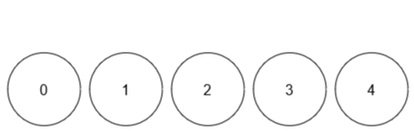

# [M] 3160. 找出球的不同顏色數量 (Find the Number of Distinct Colors Among the Balls)

## 題目

- [題目連結](https://leetcode.com/problems/find-the-number-of-distinct-colors-among-the-balls)
- **難度**：Medium
- **主題**：Array, Hash Table

## 題目描述

給定一個整數 `limit` 和一個大小為 `n x 2` 的二維陣列 `queries`。

共有 `limit + 1` 個球，每個球的標籤在範圍 `[0, limit]` 內。最初，所有球都是無色的。對於每個查詢 `queries[i] = [x, y]`，我們將標籤為 `x` 的球塗上顏色 `y`。在每次查詢後，計算所有球中不同顏色的數量。

返回一個長度為 `n` 的陣列 `result`，其中 `result[i]` 表示執行第 `i` 個查詢後，不同顏色的數量。

**注意**：如果某個顏色沒有出現在球上，則該顏色不會被計算在內。

### 範例 1

```
輸入: limit = 4, queries = [[1,4],[2,5],[1,3],[3,4]]
輸出: [1,2,2,3]
```

**解釋**：



1. 查詢 0：球 `1` 塗上顏色 `4` → 不同顏色數量 `1`
2. 查詢 1：球 `1` 為 `4`，球 `2` 為 `5` → 不同顏色數量 `2`
3. 查詢 2：球 `1` 改為 `3`，球 `2` 為 `5` → 不同顏色數量 `2`
4. 查詢 3：球 `1` 為 `3`，球 `2` 為 `5`，球 `3` 為 `4` → 不同顏色數量 `3`

### 範例 2

```
輸入: limit = 4, queries = [[0,1],[1,2],[2,2],[3,4],[4,5]]
輸出: [1,2,2,3,4]
```

**解釋**：


1. 查詢 0：球 `0` 塗上顏色 `1` → 不同顏色數量 `1`
2. 查詢 1：球 `0` 為 `1`，球 `1` 為 `2` → 不同顏色數量 `2`
3. 查詢 2：球 `0` 為 `1`，球 `1,2` 為 `2` → 不同顏色數量 `2`
4. 查詢 3：球 `0` 為 `1`，球 `1,2` 為 `2`，球 `3` 為 `4` → 不同顏色數量 `3`
5. 查詢 4：球 `0` 為 `1`，球 `1,2` 為 `2`，球 `3` 為 `4`，球 `4` 為 `5` → 不同顏色數量 `4`

### 限制條件

- `1 <= limit <= 10^9`
- `1 <= n == queries.length <= 10^5`
- `queries[i].length == 2`
- `0 <= queries[i][0] <= limit`
- `1 <= queries[i][1] <= 10^9`

---

## 問題釐清

- 從範例來理解題目的話，`queries` 中的數組指的是索引當前要畫上哪一種顏色編號，而輸出會希望是一個陣列去計算每次操作時有著色的顏色數量，長度會與 `queries` 一樣，這樣理解是正確的？
- 從限制看起來，`queries` 內的數組的索引值一定在範圍內，所以不需處理例外狀況？

## 提出思路

直覺上可以用一個迴圈去跑過每個 `queries`，過程中用一個 hash map 紀錄，為了方便每次查找索引，以索引為 key，當前顏色為 value，採後蓋前的方式。並另外用個 Set 在每次對 hash map 計算一次當前的顏色計數。

這解法會有雙層迴圈，在最差狀況時可能會是 `O(m*n)` 的時間複雜度 (m 為 limit 長度、n 為 queries 長度)，以題目限制要支援到 `10^9` x `10^5` 應該算是個暴力解會超時。

以註解表示以上的思路：

```ts
function queryResults(limit: number, queries: number[][]): number[] {
  // declare hash map (key: index, value: color)
  // run a single loop for queries to fill hash map
  // run another loop for hash map to count color amounts
  // return result
}
```

## 實作

嘗試看看：

```ts
function queryResults(limit: number, queries: number[][]): number[] {
  // declare hash map (key: index, value: color)
  const hashMap = new Map<number, number>();
  const res: number[] = [];

  // run a single loop for queries to fill hash map
  for (let [index, color] of queries) {
    hashMap.set(index, color);

    // run another loop for hash map to count amounts
    const colorSet = new Set<number>();

    for (let [_, color] of hashMap) {
      colorSet.add(color);
    }
    res.push(colorSet.size);
  }

  // return result
  return res;
}
```

通過了 `547/551` 個測資，其他的還是 TLE 了，換個方式用空間換時間，再宣告一個 colorCount 的 map 來計算每次的顏色數量：

```ts
function queryResults(limit: number, queries: number[][]): number[] {
  // declare hash map (key: index, value: color)
  const ballColors = new Map<number, number>();
  // declare hash map (key: color, value: count)
  const colorCount = new Map<number, number>();
  const res: number[] = [];

  for (let [index, newColor] of queries) {
    // handle old color
    if (ballColors.has(index)) {
      const oldColor = ballColors.get(index)!;

      // If identical, early return
      if (oldColor === newColor) {
        res.push(colorCount.size);
        continue;
      }

      // reduce old color count
      colorCount.set(oldColor, colorCount.get(oldColor)! - 1);

      // remove old color key if zero
      if (colorCount.get(oldColor) === 0) {
        colorCount.delete(oldColor);
      }
    }

    // handle new color record
    ballColors.set(index, newColor);
    colorCount.set(newColor, (colorCount.get(newColor) || 0) + 1);

    res.push(colorCount.size);
  }

  // return result
  return res;
}
```

有趣的是原本只有 beats 38.46%，加上以下這段 early return 後竟然就 beats 100% 了：

```ts
// If identical, early return
if (oldColor === newColor) {
  res.push(colorCount.size);
  continue;
}
```

## 複雜度分析

若 `n` 代表 `queries` 長度、`m` 代表 `limit`：

- 時間複雜度：最後 AC 的解法為一次對 `queries` 長度的迴圈，因此為 `O(n)`
- 空間複雜度：額外使用兩個 map 與 res 陣列，最差的狀況為 `O(m + n)`
