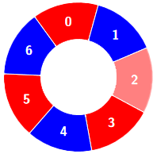

## \[M\] 3208. Alternating Groups II

## 題目

- [LeetCode 連結](https://leetcode.com/problems/alternating-groups-ii)
- **主題**：Array、Sliding Window
- **難度**：Medium (Rating: 1721)
- **Daily**：2025-03-09

## 題目描述

有一圈紅色與藍色的瓷磚。給定一個整數陣列 `colors` 和一個整數 `k`。其中 `colors[i]` 代表第 `i` 塊瓷磚的顏色：

- `colors[i] == 0` 表示瓷磚 `i` 是紅色。
- `colors[i] == 1` 表示瓷磚 `i` 是藍色。

一個 **交替群組 (Alternating Group)** 是指圓圈中任意 `k` 塊連續的瓷磚，並且具有交替顏色的特性（群組中的每一塊瓷磚（除了第一塊和最後一塊）都與其左右相鄰的瓷磚顏色不同）。

請回傳 **交替群組的數量**。

請注意，由於 `colors` 表示一個圓圈，因此第一塊與最後一塊瓷磚被視為相鄰。

---

### 範例 1

```plain
輸入: colors = [0,1,0,1,0], k = 3
輸出: 3
```

**解釋**：


符合條件的交替群組有 3 個，如下所示：


---

### 範例 2

```plain
輸入: colors = [0,1,0,0,1,0,1], k = 6
輸出: 2
```

**解釋**：


符合條件的交替群組有 2 個，如下所示：




---

### 範例 3

```plain
輸入: colors = [1,1,0,1], k = 4
輸出: 0
```

**解釋**： 無法找到符合條件的交替群組。


---

### 限制條件

- `3 <= colors.length <= 10^5`
- `0 <= colors[i] <= 1`
- `3 <= k <= colors.length`

---

## 解題思路

跟昨天的題目有點像，但稍微複雜一些是因為要考慮到環狀相鄰的狀況。想了一下沒做出來，參考了官方解答的第一種做法先做個筆記：

- 環狀陣列的問題可以用擴展的方式或取餘數的方式，這裡為了容易理解先採用空間複雜度高一些的做法用擴展 k 位的顏色值
- 第一個解法中的 sliding window 是採用從小擴大的方式，逐步去找到一組長度為 k 的窗口並做計數

```ts
function numberOfAlternatingGroups(colors: number[], k: number): number {
  // 擴展陣列以處理環狀問題
  const linearColors = [...colors];

  for (let i = 0; i < k - 1; i++) {
    linearColors.push(colors[i]);
  }

  const len = linearColors.length;
  let count = 0;

  // Sliding Window 的初始左右邊界
  let left = 0;
  let right = 1;

  while (right < len) {
    // 如果當前顏色與前一個顏色相同，則移動初始窗口
    if (linearColors[right] === linearColors[right - 1]) {
      left = right;
      right += 1;
      continue;
    }

    right += 1;

    // 當窗口大小小於 k，則跳過
    if (right - left < k) {
      continue;
    }

    // 當窗口大小 >= k，則找到一個有效的交替群組
    count += 1;

    // 縮小窗口的左邊界，尋找下一個交替群組
    left += 1;
  }

  return count;
}
```

若 `n` 代表 `colors` 的長度：

- 時間複雜度：
  - 擴展 `k` 長度的陣列： `O(k)`
  - while 迴圈來移動 sliding window：`O(n + k)`
- 空間複雜度：
  - 另外宣告一個新陣列避免變更原本的 `colors` 陣列，因此為 `O(n + k)`
