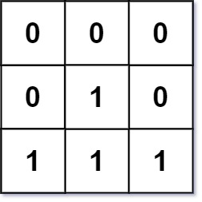
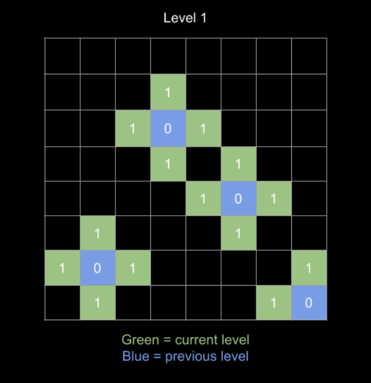

# [M] 542. 01 矩陣 (01 Matrix)

## 題目

- [LeetCode 連結](https://leetcode.com/problems/01-matrix)
- **主題**：Graph, BFS, DP
- **難度**：Medium

## 題目描述

給定一個 `m x n` 的二元矩陣 `mat`，請回傳一個同樣大小的矩陣，其中每個元素代表該位置與最近的 `0` 之間的距離。

相鄰的兩個單元格（共用一條邊）之間的距離為 `1`。

### 範例 1


```plain
輸入：mat = [[0,0,0],[0,1,0],[0,0,0]]
輸出：[[0,0,0],[0,1,0],[0,0,0]]
```

### 範例 2



```plain
輸入：mat = [[0,0,0],[0,1,0],[1,1,1]]
輸出：[[0,0,0],[0,1,0],[1,2,1]]
```

### 限制條件

- `m == mat.length`
- `n == mat[i].length`
- `1 <= m, n <= 10⁴`
- `1 <= m * n <= 10⁴`
- `mat[i][j]` 只會是 `0` 或 `1`
- `mat` 至少包含一個 `0`

### 相關題目

此題與 [1765\. Map of Highest Peak](https://leetcode.com/problems/map-of-highest-peak/) 相同。

## 問題釐清

- 題目的意思是如果該元素的值是 0，則與 0 的距離為 0，非 0 的話則要去找出與他相鄰最近的 0 的距離？
- 矩陣中一定會有一個 0？
- 矩陣的長寬至少爲 1？

## 提出測試案例

- 能通過兩個範例
- 能通過長寬為 1 的案例
- 能通過一個 `5*5` 矩陣且只有一個 0 的案例
- 長寬皆為 `10^4` 的壓測

## 提出思路

宣告一個塞滿 0 的二維陣列儲存結果，跑兩個迴圈去依序確認值是否為 0，不為 0 則去找前一個為 0 的座標計算距離。但這很明顯有機會不是最短距離。

因此後來看了 LeetCode 的官方教學後，提到最短距離的問題能直接聯想到 BFS，或還有另一種解法是用 DP，這裡先來學習一下 BFS 怎麼實作。

直覺地來解題的話我們可能會想要去找每個 1 的點離最近的 0 在哪裡，但這樣做演算法可能容易超時，假想一個 10000 \* 10000 的矩陣只有某個角落為 0，則這樣的時間複雜度也就是操作次數會需要 10^8 次。

換個角度想如果我們以每個 0 為出發點，分別一層一層往外擴張去算周遭的座標的距離，那其實答案就很容易取得：



因此這個演算法會是這樣的思路，以註解表示：

```ts
function updateMatrix(mat: number[][]): number[][] {
  // 宣告結果矩陣，使用 Infinity 為值順便確認沒有被造訪過

  // 使用 queue 紀錄下一次要執行 BFS 擴展的座標
  // 將所有值為 0 的座標放入 queue，並更新其結果陣列中的距離為 0

  // 當 queue 不為空，跑 while 迴圈執行 BFS
    // 對當前座標 4 個方向分別去紀錄其與 0 的距離
      // 確保每個方向的座標在邊界內
      // 且新座標還沒被訪問過，因此一開始初始化才要設 Infinity
      // 把新座標加入 queue，進一步往外擴展並累加

  // 回傳結果陣列
}
```

## 實作

```ts
function updateMatrix(mat: number[][]): number[][] {
  const width = mat.length;
  const height = mat[0].length;

  // 宣告結果矩陣，使用 Infinity 順便確認沒有被造訪過
  const res = Array.from({ length: width }, () => Array(height).fill(Infinity));

  // 使用 queue 紀錄所有為 0 的座標
  const queue: [number, number][] = [];

  // 將所有值為 0 的座標放入 queue，並更新其結果陣列中的距離為 0
  for (let m = 0; m < width; m++) {
    for (let n = 0; n < height; n++) {
      if (mat[m][n] === 0) {
        res[m][n] = 0;
        queue.push([m, n]);
      }
    }
  }

  // 方向向量 (上, 下, 左, 右)
  const directions = [
    [-1, 0],
    [1, 0],
    [0, -1],
    [0, 1]
  ];

  // 執行 BFS
  while (queue.length > 0) {
    const [x, y] = queue.shift()!;

    // 對當前座標每個方向去紀錄其與 0 的距離
    for (const [dx, dy] of directions) {
      const newX = x + dx;
      const newY = y + dy;

      // 確保每個方向的座標在邊界內
      if (newX >= 0 && newX < width && newY >= 0 && newY < height) {
        // 確認新座標還沒被訪問過，因此一開始才要設 Infinity
        if (res[newX][newY] > res[x][y] + 1) {
          res[newX][newY] = res[x][y] + 1;

          // 把新座標加入 queue，進一步往外擴展並累加
          queue.push([newX, newY]);
        }
      }
    }
  }

  return res;
}
```

## 撰寫測試

```ts
const testCases = [
  {
    mat: [
      [0, 0, 0],
      [0, 1, 0],
      [0, 0, 0]
    ],
    expected: [
      [0, 0, 0],
      [0, 1, 0],
      [0, 0, 0]
    ]
  },
  {
    mat: [
      [0, 0, 0],
      [0, 1, 0],
      [1, 1, 1]
    ],
    expected: [
      [0, 0, 0],
      [0, 1, 0],
      [1, 2, 1]
    ]
  },
  {
    mat: [[0]],
    expected: [[0]]
  },
  {
    mat: [
      [1, 1, 1, 1, 1],
      [1, 1, 1, 1, 1],
      [1, 1, 0, 1, 1],
      [1, 1, 1, 1, 1],
      [1, 1, 1, 1, 1]
    ],
    expected: [
      [4, 3, 2, 3, 4],
      [3, 2, 1, 2, 3],
      [2, 1, 0, 1, 2],
      [3, 2, 1, 2, 3],
      [4, 3, 2, 3, 4]
    ]
  }
];

describe('01 Matrix', () => {
  test.each(testCases)(
    'should return expected result for given matrix',
    ({ mat, expected }) => {
      expect(updateMatrix(mat)).toEqual(expected);
    }
  );

  // 壓測案例 (10^4 × 10^4 矩陣，只有左上角是 0)
  test('should handle large matrix performance test', () => {
    const largeTestSize = 10 ** 4;
    const largeMat = Array.from({ length: largeTestSize }, () =>
      Array(largeTestSize).fill(1)
    );
    largeMat[0][0] = 0;

    const result = updateMatrix(largeMat);
    expect(result[0][0]).toBe(0);
    expect(result[largeTestSize - 1][largeTestSize - 1]).toBe(
      largeTestSize * 2 - 2
    );
  });
});
```

## 複雜度分析

- 時間複雜度：最多會跑過每個點一次，因此是 `O(m * n)`
- 空間複雜度：使用的空間為宣告的 queue 與 res，因此是 `O(m * n)`
