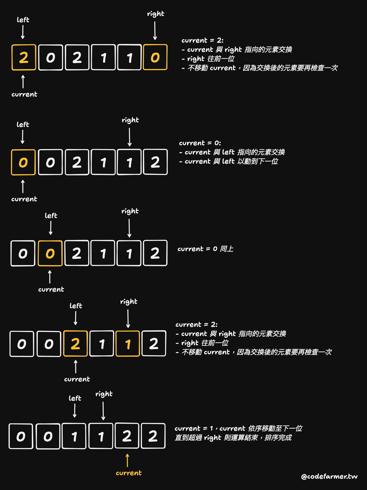

# [M] 75. 顏色分類 (Sort Colors)

## 題目

- [LeetCode 連結](https://leetcode.com/problems/sort-colors)
- **主題**：Array
- **難度**：Medium

## 題目描述

給定一個包含 `n` 個物件的陣列 `nums`，每個物件被染成紅色、白色或藍色。請你**就地 (in-place)** 排序這些物件，使得相同顏色的物件相鄰，並按照紅色、白色、藍色的順序排列。

我們用整數 `0`、`1` 和 `2` 分別表示紅色、白色和藍色。你必須在不使用內建排序函式的情況下解決這個問題。

就地 (in-place) 意思為盡可能不利用其他大量空間來達成，通常傾向使用原始資料結構直接操作。

### 範例 1

```text
輸入：nums = [2,0,2,1,1,0]
輸出：[0,0,1,1,2,2]
```

### 範例 2

```text
輸入：nums = [2,0,1]
輸出：[0,1,2]
```

### 限制條件

- `n == nums.length`
- `1 <= n <= 300`
- `nums[i]` 為 `0`、`1` 或 `2` 之一

### 進階挑戰

你是否能設計一個**只需遍歷一次**且**只使用常數額外空間**的演算法？

## 問題釐清

- 輸入至少會有一個數字，且一定為 `0`, `1`, `2`，不需處理非法輸入？
- in-place 的意思是，不需要有輸出，而是期待直接去改掉輸入陣列中的排序？
- 這題的範例看起來期待結果是升序排序？
- 基本實作能夠先不受遍歷一次的限制？

## 提出測試案例

- 能通過題目兩個範例
- 只有一個數字的輸入
- 全部同色的測試
- 完全反序的 300 個數字狀況

## 提出思路

因為題目要求一定需要 in-place，但輸入只有三種值，想到一個相對直覺的方式是可以做個 count map 去先用迴圈算出三種顏色分別出現幾次後，將原本輸入陣列去跑迴圈依數量取代當前數字，算是跑兩次迴圈的方式。用註解表示：

```ts
function sortColors(nums: number[]): void {
  // declare count map
  // run a for loop to count each amount of color
  // run a for loop to replace input nums with count map
}
```

## 實作

因為輸入只有三種數字，稍微改一下型別：

```ts
function sortColors(nums: (0 | 1 | 2)[]): void {
  // declare count map
  const counts = [0, 0, 0];

  // run a for loop to count each amount of color
  for (let num of nums) {
    counts[num]++;
  }

  // run a for loop to replace input nums with count map
  for (let i = 0; i < nums.length; i++) {
    if (counts[0]) {
      nums[i] = 0;
      counts[0]--;
    } else if (counts[1]) {
      nums[i] = 1;
      counts[1]--;
    } else {
      nums[i] = 2;
      counts[2]--;
    }
  }
}
```

感覺稍微有點暴力解，用了兩次迴圈，但多用的空間應該還算符合 in-place，只有 `O(1)` 而已。

## 撰寫測試

先用單元測試跑一遍看看是否能符合期待：

```ts
describe('Sort Colors', () => {
  test.each([
    [
      [2, 0, 2, 1, 1, 0],
      [0, 0, 1, 1, 2, 2]
    ],
    [
      [2, 0, 1],
      [0, 1, 2]
    ],
    [[1], [1]],
    [
      [2, 2, 2, 2, 2],
      [2, 2, 2, 2, 2]
    ],
    [
      Array(100).fill(2).concat(Array(100).fill(1)).concat(Array(100).fill(0)),
      Array(100).fill(0).concat(Array(100).fill(1)).concat(Array(100).fill(2))
    ]
  ])('should sort %s to %s', (input, expected) => {
    sortColors(input);
    expect(input).toEqual(expected);
  });
});
```

## 複雜度分析

- **時間複雜度**：跑兩次迴圈，如果輸入有 N 個值，則為 2N，因此為 `O(n)`
- **空間複雜度**：只額外使用了一個長度為 3 的陣列，所以是 `O(1)`

## 進階挑戰或其他解法探索

後來查了下才知道原來這個題目還被叫做**荷蘭國旗問題 ([Dutch National Flag Problem](https://en.wikipedia.org/wiki/Dutch_national_flag_problem))**，因為荷蘭國旗顏色剛好是紅白藍，且此問題最初是由荷蘭知名科學家 Edsger Dijkstra 所提出。

如果是要做到可以在一個迴圈內完成的話，要用三個指標 (three pointers) 來解，解法的思路像以下這樣：

- 使用三個指標：
  - `left`：指向應該放置 `0` 的位置，初始化為 `0`
  - `right`：指向應該放置 `2` 的位置，初始化為陣列最後一位
  - `current`：目前檢查的元素，初始化為 `0`
- 跑一個 while 迴圈，直到 current 超過 right 的位置，檢查 `nums[current]` 的值：
  - 為 `0` 的話，將 `current` 與 `left` 交換，`left++`，`current++`
  - 為 `2` 的話，將 `current` 與 `right` 交換，`right--`，但不移動 `current`，因為交換後的元素還需檢查
  - 為 `1` 的話，`current++`

覺得光看文字有點難理解，還是用個範例 `[2, 0, 2, 1, 1, 0]` 搭配實際畫圖比較好懂：



如果依照這個演算法的邏輯，實作起來其實不麻煩：

```ts
export function sortColorsThreePointers(nums: number[]): void {
  let left = 0;
  let right = nums.length - 1;
  let current = 0;

  while (current <= right) {
    if (nums[current] === 0) {
      // 交換 left 與 current 指向的元素
      [nums[left], nums[current]] = [nums[current], nums[left]];
      left++;
      current++;
    } else if (nums[current] === 2) {
      // 交換 right 與 current 指向的元素
      [nums[current], nums[right]] = [nums[right], nums[current]];
      right--;
    } else {
      current++;
    }
  }
}
```
